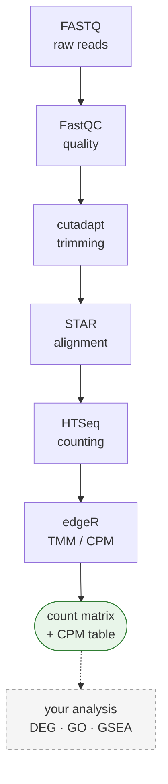

# BulkRNAseq_AutoPipeline

**Takes raw sequencing files (FASTQ) and produces a gene-level expression table.**

Interpretation steps (differential expression, GO enrichment, and so on) are *not* here.
Everything that comes *before* them is. Preprocessing is the same work in every project, so
rather than rewriting it each time, every project uses this one repository.



The green box is what this pipeline hands you. Everything after it is your analysis.

---

## Contents

1. [Before you start: what each step does](#1-before-you-start-what-each-step-does)
2. [Installation](#2-installation)
3. [Adding your data](#3-adding-your-data)
4. [Writing group.conf](#4-writing-groupconf)
5. [Running the pipeline](#5-running-the-pipeline)
6. [Strandedness: measured, and yours to settle when it is close](#6-strandedness-measured-and-yours-to-settle-when-it-is-close)
7. [Counting and normalization](#7-counting-and-normalization)
8. [Reading the results](#8-reading-the-results)
9. [Common errors](#9-common-errors)
10. [Design rules](#10-design-rules)
11. [Adding a new kit](#11-adding-a-new-kit)
12. [Self-check](#12-self-check)
13. [Running on SLURM](#13-running-on-slurm)

---

## 1. Before you start: what each step does

If this is your first time, this table is enough. Running the pipeline is two commands; the
table explains what happens inside them.

| Step | Tool | What it does | Why it is needed |
|---|---|---|---|
| Quality check | FastQC | Summarizes read length, quality scores, GC content as plots | To catch a failed sample **before** analysis. Finding out later costs days |
| Adapter removal | cutadapt | Trims the artificial sequence (adapter) stuck to the end of reads | Adapters do not exist in the genome, so leaving them makes alignment fail or land in the wrong place |
| Alignment | STAR | Finds where in the genome each read came from | RNA-seq reads have introns spliced out, so the aligner must allow a read to span two exons (splice-aware) |
| Counting | HTSeq | Counts how many reads fall in each gene | These numbers are the raw material of "expression" |
| Normalization | edgeR (TMM to CPM) | Corrects for differing total read counts between samples | If sample A has 50M reads and B has 20M, raw counts cannot be compared directly |

**Two terms up front:**

- **read**: a short sequence fragment the sequencer read out (typically 50–150 bp). A FASTQ
  file holds tens of millions of them.
- **paired-end**: both ends of the same fragment were read. Files arrive as `_1` and `_2`.
  If only one end was read it is **single-end** and there is a single file. The pipeline detects
  which one you have.

---

## 2. Installation

### 2-0. What you need first

| | |
|---|---|
| **A Linux server with a shell** | Everything here runs from the command line |
| **conda** | Miniconda or Anaconda, installed and on your `PATH`. `setup.sh` builds the tool environment with it but cannot install conda itself (see below) |
| **Disk** | Roughly 3–4× your raw FASTQ, plus ~30 GB per STAR index. A 40 GB dataset wants ~200 GB free |
| **Memory** | 32 GB or more. Building a human STAR index needs that much on its own |
| **Time** | Hours, not minutes. Downloading and processing 18 samples filled a working day |

If conda is missing, install Miniconda into your home directory. No admin rights are needed:

```bash
wget https://repo.anaconda.com/miniconda/Miniconda3-latest-Linux-x86_64.sh
bash Miniconda3-latest-Linux-x86_64.sh      # accept the defaults
exec $SHELL -l                              # reopen the shell so conda is on PATH
conda --version
```

> **A job scheduler is the one thing you may not be able to add yourself.** SLURM is part of
> how a machine is administered, so if your cluster does not already have it, installing it is
> a system administrator's job. You do not need it: `bash` and `nohup` run the pipeline exactly
> the same, and that is the normal way on a single server.
> [Section 13](#13-running-on-slurm) covers the cluster case.

### 2-1. Get the repository

Clone it into your home directory. Reference genomes, intermediates, and results all
accumulate inside this folder, so put it somewhere with room to spare (several TB).

```bash
cd ~
git clone https://github.com/YuHwanYuHwan/BulkRNAseq_AutoPipeline.git
cd BulkRNAseq_AutoPipeline
```

What the repository holds, and what appears as you use it:

```
BulkRNAseq_AutoPipeline/
│
├── setup.sh                    # environment check; --create-env builds the conda env
├── config.sh                   # per-machine settings; setup.sh writes it, git ignores it
├── README.md
│
├── rawData/                                # ← YOU put data here
│   ├── ProjectA/
│   │   ├── GroupA/
│   │   │   ├── accessions.csv              # ← YOU write this for public data: SRR/ERR/DRR
│   │   │   ├── group.conf                  # written by the download; yours to write for your own data
│   │   │   ├── metadata.tsv                # fetched from GEO / BioSample after download
│   │   │   ├── Control_1_1.fastq.gz        # flat file: filename = sample name
│   │   │   ├── Control_1_2.fastq.gz
│   │   │   ├── Treated_1_1.fastq.gz
│   │   │   └── Treated_1_2.fastq.gz
│   │   └── GroupB/
│   │       ├── group.conf
│   │       └── Control_2/                  # a folder = one sample; runs inside are merged
│   │           ├── run_A_1.fastq.gz
│   │           └── run_B_1.fastq.gz
│   └── ProjectB/
│
├── reference_Genomes/                      # ← YOU download the genome; the pipeline indexes it
│   ├── Homo_sapiens/
│   │   ├── Homo_sapiens.GRCh38.dna.primary_assembly.fa
│   │   ├── Homo_sapiens.GRCh38.113.gtf
│   │   └── index/
│   │       ├── overhang149/                # one index per read length, kept forever
│   │       └── overhang99/
│   └── Mus_musculus/
│       ├── Mus_musculus.GRCm39.dna.primary_assembly.fa
│       ├── Mus_musculus.GRCm39.115.gtf
│       └── index/overhang100/
│
├── Processed/                              # intermediates, mirrors rawData. SAFE TO DELETE
│   └── ProjectA/GroupA/
│       ├── Fastqc_result/                  # per-sample FastQC html and zip
│       ├── AdapterTrimming_result/         # *_trimmed.fastq.gz and cutadapt logs
│       ├── Alignment_result/
│       │   └── Control_1/                  # BAM and STAR Log.final.out per sample
│       └── HTseqCount_result/              # <sample>.gene.counts, one per sample
│
├── Output/                                 # final results, mirrors rawData. KEEP THIS
│   └── ProjectA/GroupA/
│       ├── GroupA_count_matrix.tsv         # raw counts, genes x samples
│       ├── GroupA_CPM.tsv                  # TMM-normalized CPM
│       ├── GroupA_multiqc_report.html
│       └── GroupA_pipeline_report.txt      # versions, parameters, QC, Methods draft
│
├── logs/                                   # SLURM job output
│
└── Scripts/                                # in the order they run
    ├── PublicData_download.sh              # SRR accessions -> FASTQ in a group folder
    ├── fetch_metadata.sh                   # GEO / BioSample -> metadata.tsv
    ├── list_samples.sh                     # print what the pipeline sees in a group
    │
    ├── run_pipeline.sh                     # wrapper: every step below, in order
    ├── FastQC.sh                           #   1. read quality
    ├── Trimming.sh                         #   2. adapter removal
    ├── AdapterSequenceList.csv             #      adapter sequences per library prep kit
    ├── RefIndexing.sh                      #   3a. builds a STAR index when one is missing
    ├── Alignment.sh                        #   3b. alignment
    ├── probe_strandedness.sh               #   4. one sample counted, for you to judge
    │
    ├── ReadCount.sh                        #   5. HTSeq counts -> count matrix
    ├── CalcCPM.sh / CalcCPM.R              #   6. TMM/CPM normalization
    ├── MultiQC.sh                          #   7. QC report + pipeline report
    │
    └── lib/
        ├── common.sh                       # sample scanning, group.conf parsing, helpers
        └── selfcheck.sh                    # logic tests that run without any tool installed
```

What you create: the FASTQ under `rawData/` (or the `accessions.csv` that fetches them) and
the genome files under `reference_Genomes/`. For public data `group.conf` and `metadata.tsv`
are written for you; for your own FASTQ, `group.conf` is where the species comes from.

`Processed/` and `Output/` are built to mirror `rawData/` exactly, so a group's intermediates
and its results are always at the same path under a different top folder.

### 2-2. Install the software

All tools go into a single conda environment.

```bash
bash setup.sh --create-env
```

This creates a conda environment named `rnaseq-preproc` containing:

| Tool | Purpose |
|---|---|
| `sra-tools` | Download FASTQ from public databases (NCBI SRA) |
| `pigz` | Parallel gzip - compresses the downloaded FASTQ on all cores |
| `FastQC` | Read quality check |
| `cutadapt` | Adapter removal |
| `STAR` | Genome alignment and index building |
| `HTSeq` | Per-gene counting |
| `MultiQC` | Merges every QC output into one report |
| `R` + `edgeR` | TMM/CPM normalization |

To do it by hand instead:

```bash
conda create -n rnaseq-preproc -c conda-forge -c bioconda \
    sra-tools fastqc cutadapt star htseq multiqc bioconductor-edger pigz
conda activate rnaseq-preproc
```

> Channel order matters. `conda-forge` must come **before** `bioconda` or dependency
> resolution breaks.

### 2-3. Prepare a reference genome

To know where a read belongs you need the **genome sequence (FASTA)** and the **gene
coordinates (GTF)**. These are large (several GB) and the version choice is yours, so you
download them yourself.

Get them from the [Ensembl FTP](https://ftp.ensembl.org/pub/) and place them in
`reference_Genomes/` **inside the repository**, in the layout below. The path is fixed; there
is no setting for it.

```
reference_Genomes/
  Homo_sapiens/
    Homo_sapiens.GRCh38.dna.primary_assembly.fa
    Homo_sapiens.GRCh38.113.gtf
  Mus_musculus/
    Mus_musculus.GRCm39.dna.primary_assembly.fa
    Mus_musculus.GRCm39.115.gtf
```

```bash
# example: human genome, Ensembl release 113
mkdir -p reference_Genomes/Homo_sapiens && cd reference_Genomes/Homo_sapiens
wget https://ftp.ensembl.org/pub/release-113/fasta/homo_sapiens/dna/Homo_sapiens.GRCh38.dna.primary_assembly.fa.gz
wget https://ftp.ensembl.org/pub/release-113/gtf/homo_sapiens/Homo_sapiens.GRCh38.113.gtf.gz
gunzip *.gz
cd ../..
```

> **Name the folder with the scientific name** (`Homo_sapiens`, `Mus_musculus`). The scripts
> locate files by that name.

**Do not download a STAR index.** An index is the genome pre-processed into a structure STAR
can search quickly, and it has to match the read length of your data, so the pipeline
**builds it when it is needed**. Once built it is kept forever and reused by later datasets.
(About 30 GB of disk per index; building one needs 32 GB or more of RAM.)

### 2-4. Verify the installation

```bash
bash setup.sh
```

Without `--create-env` this **installs nothing and only reports status**. It is safe to run as
often as you like.

```
== config ==
  [ OK ] config.sh
== tools ==
  [ OK ] prefetch
  [ OK ] STAR
  ...
== reference genomes ==
  [ OK ] Homo_sapiens  (Homo_sapiens.GRCh38.113.gtf)
== disk ==
  [ OK ] 75826G free
== self-check ==
  [ OK ] logic 6/6

Ready. Next: put FASTQ under rawData/<project>/<group>/ and write group.conf (species).
```

Fix every `[MISS]` before going further. The point of this script is to keep you from
**discovering at hour six of a STAR run that the reference genome was never there.**

`[ OK ] logic 6/6` is the pipeline checking its own logic. It runs with no bioinformatics tool
installed at all, so you can confirm the code is sound right after cloning.

<details>
<summary>When tools are not on PATH (config.sh)</summary>

`setup.sh` writes `config.sh` for you. Only `CONDA_ENV` is filled in; uncomment the rest as
needed.

```bash
# conda environment holding the tools. Every script activates it automatically
CONDA_ENV="rnaseq-preproc"

# cores for STAR, index building, trimming, and download compression.
# a SLURM reservation always wins over this
THREADS=8

# only if you use a manually downloaded FastQC instead of the conda one
FASTQC_BIN="/home/user/FastQC/fastqc"
```

The order is: a SLURM reservation first, then `THREADS`, then `nproc`. Inside a job the
reservation always wins. Reserving 32 cores and then running on 8 wastes the other 24, so if
you want fewer, reserve fewer. `THREADS` is for the case outside a job: on a shared head node,
`nproc` would hand one run every core on the machine, and a second run would then compete with
the first for them.

If your tools are already installed some other way, set `CONDA_ENV=""`.

`config.sh` differs per machine, so it is not tracked by git (`.gitignore`).
</details>

---

## 3. Adding your data

### The folder layout

```
rawData/<project>/<group>/
```

- **project**: the research unit. For example `ProjectA`
- **group**: **the unit that produces one count matrix.** For example `Treated_vs_Control`

You split into groups by asking "will these samples be compared to each other?" Controls and
treated samples belong in the same group; an unrelated experiment gets its own group.
**Normalization happens per group**, so mixing unrelated samples distorts it.

### Option A. Public data (GEO/SRA)

Make the group folder, put the accessions in a file called `accessions.csv` inside it, and give
the download script the folder. Keeping the list next to the data is the point: a year later the
folder still says which runs it was built from, and the script knows where to look without being
told twice.

```bash
mkdir -p rawData/ProjectA/GroupA

cat > rawData/ProjectA/GroupA/accessions.csv <<'EOF'
SRR0000001
SRR0000002
SRR0000003
EOF

bash Scripts/PublicData_download.sh rawData/ProjectA/GroupA
```

**The file has no format.** Every `SRR`/`ERR`/`DRR` accession found anywhere in it is used and
duplicates are dropped, so all of these are the same input:

```
SRR0000001          SRR0000001,SRR0000002,SRR0000003        Run,Assay Type,Bases
SRR0000002                                                  SRR0000001,RNA-Seq,3042910600
SRR0000003                                                  SRR0000002,RNA-Seq,1474362300
```

The last one is a run table saved straight from SRA Run Selector. Save it as
`accessions.csv` in the group folder and run, nothing to clean up first. For a consecutive
range there is no need to type them out:

```bash
seq 38207576 38207593 | sed 's/^/SRR/' > rawData/ProjectA/GroupA/accessions.csv
```

A handful of runs needs no file at all:

```bash
bash Scripts/PublicData_download.sh rawData/ProjectA/GroupA SRR0000001 SRR0000002
```

### Several groups in one command

Give it more than one folder and it works through them in order, each reading its own
`accessions.csv`. Downloading is the slow part of this pipeline, so this is mainly a way to set
up an evening of it and stop waiting for one group to finish before starting the next.

```bash
bash Scripts/PublicData_download.sh rawData/ProjectA/GroupA                                     rawData/ProjectA/GroupB                                     rawData/ProjectB/GroupA
```

Every list is read and checked before anything is downloaded, so a folder with no
`accessions.csv` stops the command immediately rather than twelve hours later.

Once it is running, a failure costs one run rather than the whole command. A run that fails is
reported and skipped, the rest continue, and no `.done` flag is written for it. Re-running the
same command retries exactly those runs, because every finished one is skipped. The command
exits non-zero when anything failed, and lists what to look at:

```
[DONE] 3 group(s), 43 run(s)

[FAIL] rawData/ProjectA/GroupB/SRR0000017
       Re-run the same command: finished runs are skipped, only these are retried.
```

Downloading needs internet access, which on a cluster usually means the login node rather than a
compute node. A long run survives a dropped connection if you start it under `nohup` or in a
`tmux` session.

The script downloads the FASTQ files, compresses them, **groups runs into a subfolder when
several belong to one sample**, and then collects the sample metadata.

That grouping matters. A single GEO sample (GSM) is often split into several SRA runs (SRR).
Treating each run as its own sample **inflates your sample count and halves the apparent
expression.** To get it right the script fetches SRA runinfo into `.runinfo.csv` and reads the
`SampleName` column; later steps then merge those runs automatically. That file is machinery,
not your metadata; ignore it.

### The metadata table

runinfo says which sample a run belongs to and nothing about what the sample *is*. The
conditions live in GEO, or in BioSample for submissions that never went through GEO, so
`fetch_metadata.sh` reads them from there and joins on the sample accession. It runs once all
the downloading is finished, so a hiccup at GEO ends up at the bottom of the log where you will
see it instead of somewhere in the middle of a run that carried on for hours. It can also be run
again on its own:

```bash
bash Scripts/fetch_metadata.sh rawData/ProjectA/GroupA
```

The result is `metadata.tsv`, one row per run, one column per attribute the submitter used:

```
Run         Sample      Series     BioProject    BioSample     Title             tissue            treatment
SRR0000001  GSM0000001  GSE000000  PRJNA0000000  SAMN00000001  Donor A, control  peripheral blood  Transduced with SCR0
SRR0000002  GSM0000002  GSE000000  PRJNA0000000  SAMN00000002  Donor A, treated  peripheral blood  Transduced with SCR(S2-S2)
```

The accession columns are there so a matrix you find a year later still says where it came
from: series, project, and sample, next to the run that produced each column.

**The title and the characteristics are both recorded on purpose.** They are two things the
submitter typed, and in real datasets they sometimes disagree: a title saying one condition
while the treatment field says another, consistently across every sample. Nothing can tell from
the outside which one is right, so both are written down and the conflict is visible instead of
resolved by guesswork. Read this file before you name anything.

Nothing in the pipeline reads `metadata.tsv`. You do, to know which count-matrix column is
which condition. Checking that the dataset is genuinely bulk RNA-seq, not single-cell or 3'-tag,
belongs to the same look, and is on you: the pipeline will happily process 10x reads
into meaningless counts.

### Option B. Your own data

Just drop the FASTQ files into the group folder. **The filename is the sample name.**

```
rawData/ProjectA/GroupA/
    Control_1_1.fastq.gz       <- sample: Control_1 (paired-end)
    Control_1_2.fastq.gz
    Treated_1_1.fastq.gz       <- sample: Treated_1
    Treated_1_2.fastq.gz
    Treated_2.fastq.gz         <- sample: Treated_2 (single-end)
    Control_2/                 <- folder name is the sample name; runs inside are merged
        run_A_1.fastq.gz
        run_A_2.fastq.gz
        run_B_1.fastq.gz
        run_B_2.fastq.gz
```

There are only three rules.

| Layout | Interpretation |
|---|---|
| Flat files `X_1.fastq.gz` + `X_2.fastq.gz` | Sample `X`, paired-end |
| Flat file `X.fastq.gz` | Sample `X`, single-end |
| Folder `X/` | Sample `X`, every run inside is merged |

**There is no sample sheet.** The directory structure is the single source of truth. A separate
sheet silently produces wrong results the moment it disagrees with the files on disk.

To check what the pipeline sees:

```bash
bash Scripts/list_samples.sh rawData/ProjectA/GroupA
```

Output is `sample <TAB> R1 <TAB> R2`. What you see there is exactly what will be processed. A
sample missing from this list stays missing, so it is worth a look before starting a job that
runs for hours.

---

## 4. Writing group.conf

**For public data you do not write it at all.** The download takes the species from runinfo and
writes the file; the probe fills in the strandedness later. It is written only when absent, so
a conf you edited by hand is never overwritten, and a group holding more than one organism gets
nothing, which is a mistake to look at rather than to guess past.

For your own FASTQ there is no runinfo, so this is where the species comes from:

```bash
cat > rawData/ProjectA/GroupA/group.conf <<'CONF'
species      = Homo_sapiens
adapter_kit  = Illumina_TruSeq
strandedness =
CONF
```

| Field | Required | Description |
|---|---|---|
| `species` | yes | Must match a folder name under `reference_Genomes/` exactly |
| `adapter_kit` | no | Library prep kit. Defaults to `Illumina_universal`. See `Scripts/AdapterSequenceList.csv` |
| `strandedness` | usually not | **Leave it empty.** The probe fills it in, and only asks you when the result is borderline (section 6) |

Spaces around `=`, quotes, and `#` comments are all accepted.

<details>
<summary>Why is read length or paired/single not in here?</summary>

The rule is: **anything derivable from the data is never asked of a human.** Read length comes
from the FASTQ; layout comes from the file count. Every field a person types is another chance
for a typo to corrupt the result.

`strandedness` is the opposite case: it **cannot be known without counting the data**, so a
person supplies it.
</details>

---

## 5. Running the pipeline

```bash
bash Scripts/run_pipeline.sh rawData/ProjectA/GroupA
```

This runs every step in order: FastQC, cutadapt, STAR, the strandedness probe, HTSeq, CPM,
and the QC report. The probe records an unambiguous strandedness itself, so the run carries
straight on to counting without asking.

**It takes hours.** On the run these figures come from, 18 human samples at 32 threads with
roughly 22M read pairs each, alignment took 55 minutes and counting 40. Your own timings will
differ with depth, thread count and disk. A first run also builds the STAR index, which we have
not timed here and should be expected to take hours. To keep it going after you disconnect:

```bash
nohup bash Scripts/run_pipeline.sh rawData/ProjectA/GroupA > logs/run.log 2>&1 &
tail -f logs/run.log      # Ctrl+C stops watching, not the job
```

To stop a background run later, kill the whole process group. Killing the wrapper alone
leaves `STAR` or `cutadapt` running as orphans:

```bash
kill -- -$(ps -o pgid= <PID> | tr -d ' ')
```

On a cluster you would submit this as a job instead (see [section 13](#13-running-on-slurm)).

Every step stamps its start and end, so the log reads as a timeline and a slow step is obvious
without timing anything yourself:

```
[2026-08-26 11:02:14] ==> FastQC
[FQC ] Control_1
...
[2026-08-26 11:41:07] <== FastQC  00:38:53
[2026-08-26 11:41:07] ==> Trimming
```

A failed step is stamped too, with its exit code.

### What a healthy run looks like

```
[2026-08-26 11:02:14] ==> FastQC
[FQC ] Control_1
[FQC ] Control_2
...
[DONE] FastQC 18 samples -> .../Processed/ProjectA/GroupA/Fastqc_result
[2026-08-26 11:41:07] <== FastQC  00:38:53

[2026-08-26 11:41:07] ==> Trimming
[KIT ] Illumina_universal  R1=AGATCGGAAGAGCACACGTCT  R2=AGATCGGAAGAGCGTCGTGTA
[TRIM] Control_1
...
[DONE] cutadapt 18 samples -> .../AdapterTrimming_result
[2026-08-26 13:20:41] <== Trimming  01:39:34

[2026-08-26 13:20:41] ==> Alignment
[LEN ] max trimmed read = 150bp -> sjdbOverhang=149
[IDX ] reuse .../reference_Genomes/Homo_sapiens/index/overhang149
[STAR] Control_1
...
[DONE] STAR 18 samples -> .../Alignment_result
[2026-08-26 14:16:02] <== Alignment  00:55:21

[2026-08-26 14:16:02] ==> probe_strandedness
[PROBE] sample=Control_1  -s reverse
...
```

The step names and the shape are what the pipeline prints. The durations are from one run of
18 human samples on 32 threads, and the sample names have been changed.

Four things say it is going right:

| Line | What to check |
|---|---|
| `[DONE] FastQC 18 samples` | the count matches the samples you expect. This is the first place a missing file shows up |
| `[KIT ] ... R1=AGATCGG...` | an adapter was found for your kit. `R2=(none)` is correct for single-end |
| `[LEN ] ... sjdbOverhang=149` | derived from your trimmed reads. 150 bp reads give 149 |
| `[IDX ] reuse ...` | an existing index fits. `[IDX ] building ...` instead means a new one is being made, which is correct but adds hours |

`[SKIP] Control_1` appears when you re-run after an interruption. That is the `.done` marker doing its
job, not an error. A resumed run reports the group's full size with a note, so the count stays
comparable:

```
[SKIP] Control_1
...
[DONE] FastQC 18 samples -> .../Fastqc_result  (18 already done)
```

> **It is fine if it dies partway.** Finished samples leave a `.done` marker, so re-running
> prints `[SKIP]` for them and resumes where it stopped. Just issue the same command again.

<details>
<summary>Running the steps one at a time</summary>

Every script takes **one group folder** and nothing else.

```bash
bash Scripts/FastQC.sh             rawData/ProjectA/GroupA
bash Scripts/Trimming.sh           rawData/ProjectA/GroupA
bash Scripts/Alignment.sh          rawData/ProjectA/GroupA
bash Scripts/probe_strandedness.sh rawData/ProjectA/GroupA
```
</details>

---

## 6. Strandedness: measured, and yours to settle when it is close

### What is being decided

Depending on how the library was prepared, the data may or may not preserve **which strand of
the original RNA a read came from**. That is `strandedness`.

| Value | Meaning |
|---|---|
| `no` | No strand information (unstranded). Reads on either strand are counted |
| `reverse` | Strand-aware; reads run **opposite** to the gene (most modern kits) |
| `yes` | Strand-aware; reads run in the **same** direction as the gene |

**Getting this wrong raises no error.** Reads are silently dropped instead of being assigned to
genes, and you end up with a table whose expression values are uniformly deflated. That is why
it gets checked before proceeding.

### Why it is measured rather than looked up

Because the kit name does not predict it. Datasets exist that carry the name
`SureSelect Strand Specific` and are nonetheless unstranded. Trusting the name means being
wrong without noticing.

So the pipeline counts one sample and reads the answer off the data. An unambiguous answer is
recorded and the run carries on; one that lands between the cases stops and asks you. The line
between those two is drawn deliberately wide.

### How to decide

`probe_strandedness.sh`, which runs right after alignment, counts **a single sample** with
`-s reverse` and shows you the outcome.

```
[PROBE] sample=Control_1  -s reverse

  total reads counted : 18036903
  assigned to genes   : 8983930 (49.8%)
  __no_feature        : 7858202 (43.6%)
  __ambiguous         : 562437

  --> likely strandedness : no        (about half assigned -> unstranded)
```

That is a real run, and a good example of why the kit name is not the answer: the library was
a poly-A prep from a vendor whose standard kit is directional, yet only half the reads land on
the sense strand. The data says unstranded, so unstranded it is.

`__no_feature` is the **fraction of reads that could not be assigned to any gene**, and one
reverse run separates all three cases: reads were assigned, so the assumption held; half sit on
the other strand, so there is no strand information; almost nothing was assigned, so the
direction was backwards.

**An unambiguous result is written into `group.conf` and the run carries on.** The bands leave
gaps between the three cases on purpose:

| `__no_feature` under `-s reverse` | What happens |
|---|---|
| under 25% | `reverse` recorded, run continues |
| 40–60% | `no` recorded, run continues |
| over 75% | `yes` recorded, run continues |
| **25–40% or 60–75%** | **stops with exit code 2 and asks you** |

The gaps are the point. Cut points that touch would make 34% and 36% different answers off a
difference that means nothing, and a wrong strandedness never announces itself; it just
deflates every count. Near a boundary an interruption beats a coin flip. Libraries that land in
a gap tend to be the ones worth a second look: rRNA-depleted total RNA carries more intronic
signal, a degraded sample assigns less of everything.

When it stops it prints the three commands and picks none of them:

```
  __no_feature 31.2% falls between the three cases, so nothing was written.
  This is the call the pipeline will not make for you. Read the numbers above,
  probe another sample if it helps, then record one of:

      sed -i 's/^strandedness.*/strandedness = reverse/' rawData/ProjectA/GroupA/group.conf
      sed -i 's/^strandedness.*/strandedness = no/'      rawData/ProjectA/GroupA/group.conf
      sed -i 's/^strandedness.*/strandedness = yes/'     rawData/ProjectA/GroupA/group.conf
```

`PROBE_AUTO=0` keeps every decision manual however clear the number is. Use it when the point is
that someone reads it themselves rather than that a matrix appears quickly.

---

## 7. Counting and normalization

Nothing to launch here. Once the strandedness is settled the same run continues into HTSeq,
the count matrix, CPM, and the QC report.

**If the probe put the run on hold**, record the value and run the same command again. Every
step skips what it already finished, so it resumes at counting rather than starting over:

```bash
sed -i 's/^strandedness.*/strandedness = no/' rawData/ProjectA/GroupA/group.conf
bash Scripts/run_pipeline.sh rawData/ProjectA/GroupA
```

Counting refuses to start while the value is missing, which beats burning hours on a wrong one:

```
[ERROR] group.conf strandedness must be no|yes|reverse (got 'empty')
        run: bash Scripts/probe_strandedness.sh rawData/ProjectA/GroupA
```

### What a healthy run looks like

```
[2026-08-26 14:29:11] ==> ReadCount
[HTSEQ] strandedness=reverse  gtf=Homo_sapiens.GRCh38.113.gtf
[CNT ] Control_1
...
[DONE] HTSeq 18 samples
       matrix: .../Output/ProjectA/GroupA/GroupA_count_matrix.tsv  (78932 genes x 18 samples)
[2026-08-26 15:09:40] <== ReadCount  00:40:29

[2026-08-26 15:09:40] ==> CalcCPM
[CPM ] 78932 genes x 18 samples -> .../GroupA_CPM.tsv
[2026-08-26 15:09:52] <== CalcCPM  00:00:12

[2026-08-26 15:09:52] ==> MultiQC
[DONE] .../Output/ProjectA/GroupA/GroupA_pipeline_report.txt
[2026-08-26 15:10:30] <== MultiQC  00:00:38
```

No `[WARN]` line is the point here. `[WARN] Control_1: __no_feature 68.3%` means the
strandedness is wrong. Fix `group.conf`, delete the `.done` markers under
`Processed/.../HTseqCount_result/`, and run the pipeline again.

The gene count depends on the annotation, not on your data: every sample in a group is counted
against the same GTF, so the matrix has the same number of rows whatever you sequenced. Ensembl
release 113 for human gives 78,932 rows, every biotype included.

`pipeline_report.txt` closes the run with the numbers worth checking:

```
[ QC summary ]
  uniquely mapped   mean 93.7%  min 92.0%
  __no_feature      mean 2.9%  max 3.3%
```

A low `__no_feature` is the confirmation that the strandedness call was right: the same
library read 43.6% under the probe's `-s reverse` and 2.9% once counted as unstranded.

---

## 8. Reading the results

```
Output/<project>/<group>/
    <group>_count_matrix.tsv      raw counts, genes x samples
    <group>_CPM.tsv               TMM-normalized CPM
    <group>_multiqc_report.html   QC summary for every step (open in a browser)
    <group>_pipeline_report.txt   versions, parameters, QC, and a Methods draft
```

**`count_matrix.tsv`** is the input to whatever comes next, such as differential expression.

```
Gene              Control_1  Control_2  Treated_1  Treated_2
ENSG00000000003        1284       1301        997       1043
ENSG00000000005           0          0          0          0
```

From here the count matrix goes into whatever you use for differential expression. DESeq2 and
edgeR in R are the usual choices, both of which take **raw counts**, not the CPM table. The CPM
file is for plotting and clustering, where library size has to be out of the way. That analysis
is deliberately not part of this repository: preprocessing is identical everywhere, while the
comparison you run is specific to your question.

**`pipeline_report.txt`** exists for the day you write the paper. It records the tool versions,
parameters, and genome release, and ends with a Methods paragraph you can edit rather than
compose, so that a year later you are not hunting for which STAR version you used.

<details>
<summary>What the report contains</summary>

```
[ Reference ]
  species       Homo sapiens  (GRCh38)
  annotation    Homo_sapiens.GRCh38.113.gtf   (Ensembl release 113)
  STAR index    overhang 149

[ Software ]
  FastQC        v.0.12.1
  Cutadapt      v.5.2
  STAR          v.2.7.11b
  HTSeq-count   v.2.1.2
  edgeR         v.4.6.3
  R             v.4.5.3
  MultiQC       v.1.35

  ready to paste:
  FastQC (v.0.12.1), Cutadapt (v.5.2), STAR (v.2.7.11b),
  HTSeq-count (v.2.1.2), edgeR (v.4.6.3) on R (v.4.5.3)

[ QC summary ]
  input reads       mean 22.3M  range 17.9-32.2M   per sample, after trimming
  uniquely mapped   mean 93.7%  min 92.0%
  __no_feature      mean 2.9%  max 3.3%

[ Methods draft ]
  Sequencing was paired-end at 150 bp, with an average of 22.3M reads per sample. Raw
  reads were assessed with FastQC (v.0.12.1) and adapters were removed with
  Cutadapt (v.5.2; minimum length 20 bp). Trimmed reads were aligned to the
  Homo sapiens GRCh38 reference genome (Ensembl release 113) with STAR
  (v.2.7.11b; sjdbOverhang 149, mismatch rate <= 0.03, up to 10 multimapping
  loci); 93.7% of reads mapped uniquely. Gene-level counts were obtained with
  HTSeq-count (v.2.1.2) in unstranded mode and normalised to counts per million
  via the trimmed mean of M-values (TMM) method in edgeR (v.4.6.3) running on
  R (v.4.5.3).
```

Versions are read from the installed tools at run time, not hardcoded, so the report describes
the run that actually happened. Whatever you do downstream (expression filtering, the
comparisons you test) is yours to add; the report stops where the pipeline does.
</details>

<details>
<summary>What to look at in the MultiQC report</summary>

- **FastQC, Per base sequence quality**: a sharp drop at the 3' end may call for more trimming
- **cutadapt, Filtered Reads**: losing an unusual fraction suggests the wrong kit was specified
- **STAR, Alignment Scores**: uniquely mapped below ~70% is a reason to double-check the species
</details>

### `Processed/` can be deleted

```
Processed/<project>/<group>/
    Fastqc_result/  AdapterTrimming_result/  Alignment_result/  HTseqCount_result/
```

These are trimmed FASTQ and BAM files, so they are large: one to two times the raw data.
They are **regenerated from the raw data and these scripts at any time**, so they are not
backup material; delete them when disk runs short.

---

## 9. Common errors

| Message | Cause | Fix |
|---|---|---|
| `not under rawData/` | The group folder is not below `rawData/` | Use the form `rawData/<project>/<group>` |
| `group.conf must define species` | `species` missing or misspelled | Match the `reference_Genomes/` folder name, including case |
| `kit 'XXX' not in AdapterSequenceList.csv` | Unknown kit name | Add a row (section 11), or leave `adapter_kit` empty |
| `strandedness must be no\|yes\|reverse` | The probe held, and the value was never recorded | See section 6 |
| `run Trimming.sh first` | A step was skipped | Run the steps in order |
| `produced no valid BAM` | STAR died, usually out of memory | Check the log. Index building needs 32 GB or more of RAM |
| `[WARN] __no_feature 68.3%` | Wrong strandedness | Correct the value, delete `Processed/*/HTseqCount_result/.*.done`, re-run |

**To force a re-run**, delete the `.done` markers of that step.

```bash
rm -f Processed/ProjectA/GroupA/HTseqCount_result/.*.done   # redo HTSeq only
rm -rf Processed/ProjectA/GroupA                            # redo everything
```

---

## 10. Design rules

Why the pipeline looks the way it does. Read this before changing anything.

- **The directory is the source of truth for sample identity.** There is no sample sheet. The
  moment a sheet disagrees with the files on disk you get quietly wrong results, and nobody
  notices.

- **Derivable values are never asked for; underivable ones stop the run.** Read length, layout,
  and species come from the data. Strandedness gets no silent default: an empty value is
  refused.

- **`sjdbOverhang` is computed from the data**: maximum read length after trimming, minus one.
  It is the length of sequence STAR places on each side of a splice junction when aligning
  reads that cross one, and **every sample in a group must use the same value**, or the
  counts are not comparable.

- **A STAR index is kept forever once built.** The next dataset needing the same overhang
  reuses it; the version it was built against is recorded in each group's pipeline report.

- **Samples run serially.** Parallelizing them across SLURM array tasks measured slower: STAR
  saturates I/O and memory bandwidth before CPU, so giving one sample all the cores wins.

- **`.done` resumes, but output validity is checked too.** A dead node can leave a 0-byte BAM
  behind, and trusting the marker alone would let it pass as complete.

- **Preprocessing happens in this repository only.** Do not copy it per project. Research
  projects consume `Output/<project>/<group>/` and nothing else.

---

## 11. Adding a new kit

When you meet an unknown kit, add one row to `Scripts/AdapterSequenceList.csv`. Every later
dataset reuses it.

```csv
kit,adapter_R1,adapter_R2
MyNewKit,AGATCGGAAGAGCACACGTCT,AGATCGGAAGAGCGTCGTGTA
```

You can find the adapter sequence in the kit manual or in the FastQC *Adapter Content* plot.
`adapter_R2` is used only for paired-end data and ignored otherwise.

**Strandedness does not belong in this file**: the kit name does not predict it (section 6).

---

## 12. Self-check

```bash
bash setup.sh                    # full environment, self-check included
bash Scripts/lib/selfcheck.sh    # logic only
```

This exercises sample scanning, merge grouping, `group.conf` parsing, overhang computation,
matrix assembly, and probe interpretation. **It runs with no bioinformatics tool installed**,
so you can verify the code right after cloning, and use it as a regression check after editing
a script.

---

## 13. Running on SLURM

The wrapper is a valid batch script as it stands: the `#SBATCH` directives sit inside
it, so `sbatch` needs no extra arguments.

```bash
cd ~/BulkRNAseq_AutoPipeline      # submit from the repository root
sbatch Scripts/run_pipeline.sh rawData/ProjectA/GroupA
squeue -u $USER
```

> Submit from the repository root. The log path in the directives is relative
> (`logs/rnaseq_%j.out`), so submitting from elsewhere leaves the job nowhere to write and it
> fails before running anything.

What the wrapper reserves:

| Script | Cores | Memory | Why |
|---|---|---|---|
| `run_pipeline.sh` | 32 | 96 GB | STAR needs a 30 GB index in memory, and building one wants 32 GB+ on its own |

Override per submission when a dataset is unusually large or the queue is busy; the command
line beats the directives in the file:

```bash
sbatch --cpus-per-task=16 --mem=48G Scripts/run_pipeline.sh rawData/ProjectA/GroupA
```

Stage 2 scales almost linearly: `htseq-count` is single-threaded and CPU-bound, measured at
~23,000 read pairs per second whether one or four run side by side. Reserving more cores counts
more samples at once.

**You do not also have to set `THREADS`.** The scripts read `SLURM_CPUS_PER_TASK`, so the
tools use exactly what the job reserved; reserve less and they scale down with it.

Logs land in `logs/rnaseq_<jobid>.out`, timestamps included, so
`tail -f` shows which step is running and what the previous one cost.

```bash
tail -f logs/rnaseq_*.out
scancel <jobid>                   # SLURM kills the whole job, orphans and all
```

**Steps are chained inside one job rather than across several.** Nothing needs `--dependency`:
`run_pipeline.sh` is a single job running its steps in order, and `set -e` stops it at the
first failure. The one place it can pause is the strandedness hold, and that ends the job.
You record the value and submit again, which resumes rather than restarts.
